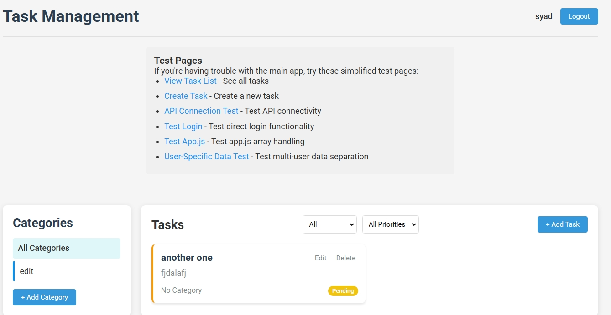
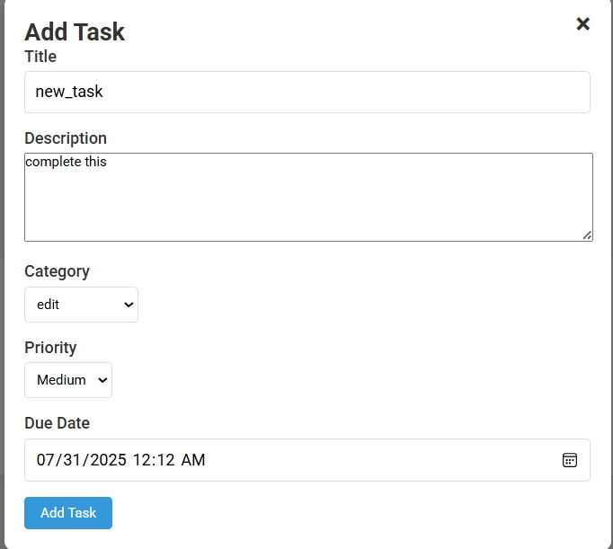

# 📋 Task Management API

A comprehensive full-stack task management solution with a RESTful API backend and a clean, responsive frontend.



## 🚀 Features

- **User Authentication** - Secure login and registration with JWT tokens
- **Task Management** - Create, read, update, and delete tasks
- **Categories** - Organize tasks by custom categories
- **Filtering & Sorting** - Filter tasks by status, priority, and category
- **Responsive Design** - Works on desktop and mobile devices
- **Multi-User Support** - Data separation between different users

## 🛠️ Tech Stack

### Backend
- PowerShell-based API server (port 9000)
- In-memory data storage with JSON serialization
- RESTful API design
- JWT authentication

### Frontend
- Vanilla JavaScript
- HTML5 & CSS3
- Responsive design
- PowerShell-based web server (port 3000)

## 🔧 Getting Started

### Prerequisites
- Windows with PowerShell 5.1+
- Modern web browser (Chrome, Firefox, Edge)

### Installation & Setup

1. Clone the repository:
   ```
   git clone https://github.com/syaddays/task-manager-api.git
   cd task-manager-api
   ```

2. Start the servers:
   ```
   .\start-servers.bat
   ```
   
   This will start:
   - API server on http://localhost:9000
   - Frontend server on http://localhost:3000

3. Open your browser and navigate to http://localhost:3000

### Default Login Credentials
- Username: `testuser`
- Password: `password123`

Or

- Username: `syad`
- Password: `Syad12345`

## 📚 API Documentation

### Authentication Endpoints
- `POST /api/auth/direct-login` - User login
- `POST /api/auth/register` - User registration

### Task Endpoints
- `GET /api/tasks` - Get all tasks for the authenticated user
- `GET /api/tasks/{id}` - Get a specific task
- `POST /api/tasks` - Create a new task
- `PUT /api/tasks/{id}` - Update a task
- `DELETE /api/tasks/{id}` - Delete a task

### Category Endpoints
- `GET /api/categories` - Get all categories for the authenticated user
- `POST /api/categories` - Create a new category
- `PUT /api/categories/{id}` - Update a category
- `DELETE /api/categories/{id}` - Delete a category

## 📱 Screenshots

### Task Dashboard


### Task Creation


## 🛑 Stopping the Servers

To stop both servers, run:
```
.\stop-servers.bat
```

Or use the provided `kill-servers.bat` if you encounter any issues:
```
.\kill-servers.bat
```

## 📄 License

This project is licensed under the MIT License - see the LICENSE file for details.

## 👨‍💻 Author

- **Syad** - [GitHub Profile](https://github.com/syaddays) 
